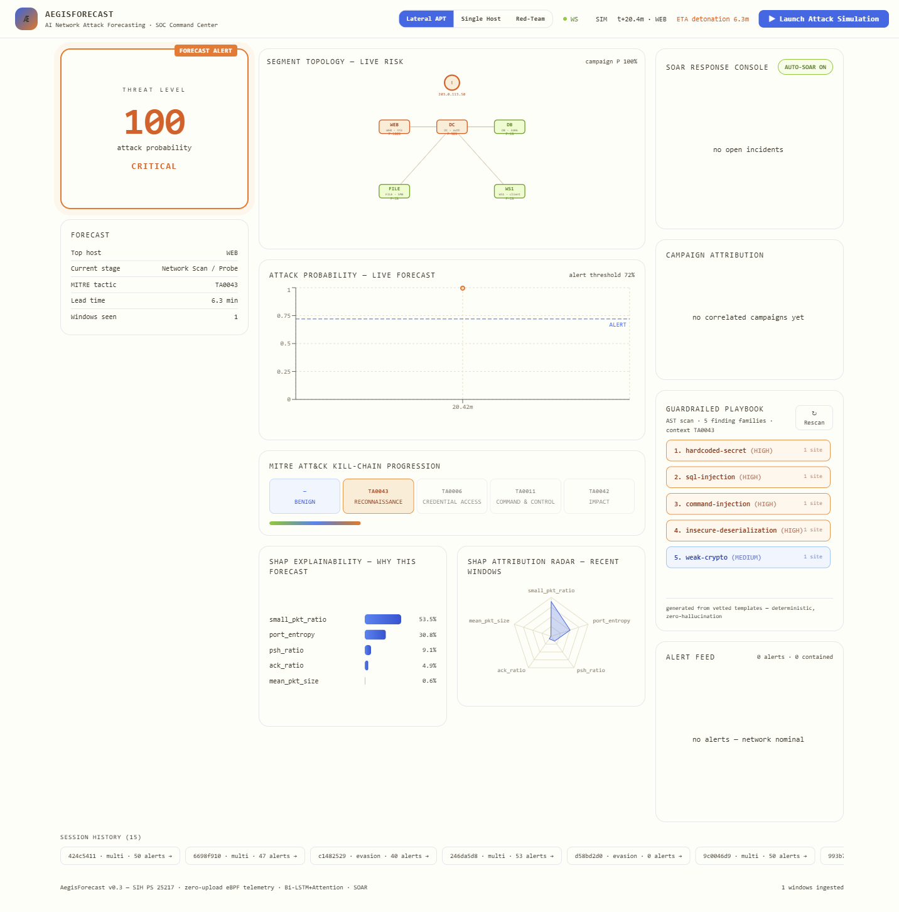

# ÆgisForecast — SOC Platform

**AI-based Network Attack Forecasting from Network Traffic Data** — SIH / NTRO PS 25217

> Forecasts cyber attacks **before detonation**, not after — and now does it as a
> full SOC platform. A zero-upload telemetry engine folds live traffic into
> in-memory 5-second bidirectional flow statistics (no pcap ever written),
> per-host Bi-LSTM + Attention forecasters (with a Transformer challenger)
> predict attack trajectories with a 10–30 minute lead time, every alert is
> enriched with threat intel, correlated into campaigns, explained with SHAP
> attribution, and high-confidence sustained forecasts auto-dispatch
> containment via a SOAR state machine. Multi-host lateral movement is
> visible on a live topology map; every session is recorded, replayable, and
> exportable as an executive incident report.



## Proof (see `docs/metrics.md` — auto-generated by the eval harness)

```
forecaster        : Bi-LSTM+Attention seq48+slope  AUC 0.961 | Transformer AUC 0.984
lead time         : median 15.2 min before detonation (p10 11.3 / p90 22.9, 100% coverage)
false positives   : 0.7 alerts/hour on pure-benign traffic (measured, not claimed)
per-host live     : WEB 0.998 under attack vs benign hosts 0.013 (perimeter view, threshold 0.72)
horizon error     : 6.5 min MAE
explain latency   : ~6ms per window (budget 15ms) | WS <500ms | zero pcap
CIC-IDS2017       : zero-shot transfer validation on real captured attacks (Colab)
replay A/B        : same session through BiLSTM vs Transformer — live comparison chart
```

## Architecture — SOC Platform (Phase 3)

```
                                      ┌─ Threat intel KB ─┐
                                      │  IP reputation    │
Live traffic ──▶ eBPF kernel probe ──▶ 5s flow aggregator ─┤  geo / IoC    ├───▶ Campaign correlator
  (or Scapy sim)   (prod) / lab      [zero-upload, per-host perimeter view]
                                      └───────────────────┘
                                              │
                    ┌─────────────────────────┼─────────────────────────┐
                    ▼                         ▼                         ▼
          Bi-LSTM+Attention (seq48+slope)  Transformer challenger   Ensemble (replay A/B)
                    │                         │                         │
                    └─────────────┬───────────┘                         │
                                  ▼                                     │
                    ┌─ P(attack in 30 min) ─┐                            │
                    ├─ MITRE stage (TA0043→TA0042)                        │
                    ├─ horizon (min to detonation)                        │
                    ├─ SHAP (gradient×input) + SHAP radar                 │
                    └──────────┬──────────────────────┘                   │
                               ▼                                          │
                    ┌─ SOAR state machine ─┐   ┌─ Session recorder ─┐     │
                    │ detected→triaged→    │   │  packets + forecasts│◀────┘
                    │ contained→verified→  ├──▶│  JSON replay       │
                    │ closed (auto+manual) │   │  A/B overlay chart │
                    └──────────┬───────────┘   └─────────┬──────────┘
                               ▼                         ▼
                    ┌─ Guardrailed playbook ─┐  ┌─ Incident report ─┐
                    │  built-in AST scanner  │  │  Markdown + HTML  │
                    │  deterministic templates│  │  executive export │
                    └──────────┬─────────────┘  └───────────────────┘
                               ▼
                    FastAPI + WebSockets (<500ms) ──▶ React 18 SOC Dashboard
                      ├─ live topology map (5-host segment, risk-colored)   │
                      ├─ threat gauge + forecast chart + kill-chain          │
                      ├─ SHAP bars + radar + campaign panel                  │
                      ├─ SOAR console (respond buttons, auto-SOAR toggle)   │
                      ├─ playbook viewer + report download + history         │
                      └─ replay A/B chart + session-kind picker (single/multi/evasion)

Persistence: SQLite (sessions, alerts, actions, intel, reports) — zero-config
Privacy: zero pcap written — in-memory flow stats only, per-host perimeter view
```

## Quickstart — Full SOC Demo

```powershell
# one-command demo (backend + dashboard + live lateral-APT session)
powershell -ExecutionPolicy Bypass -File scripts\demo_all.ps1
# opens http://localhost:5173 — pick kind: Lateral APT | Single Host | Red-Team

# choose session kind from the dashboard header:
#   Lateral APT  — 5-host segment (DC/WEB/DB/FILE/WS1), kill-chain spread on the topology map
#   Single Host  — classic APT vs one server (the original demo)
#   Red-Team     — stealth scan + mimicry (one evades, honest analysis at /api/evasion/analysis)

# or step-by-step:
pip install -r requirements.txt
python -m aegis.ml.train --epochs 8 --model bilstm        # ~4 min on CPU (cached windows)
python -m aegis.ml.train --epochs 10 --model transformer  # challenger (AUC 0.984)
python -m aegis.server                                     # http://127.0.0.1:8000
cd frontend && npm install && npm run dev                  # http://localhost:5173

# evaluate: FP rate + lead-time distribution + threshold calibration
python -m aegis.ml.evaluate                # writes docs/metrics.md

# headless demo (no browser)
python demo/run_demo.py                                    # single-host
python scripts/e2e_multi_smoke.py                          # multi-host SOC flow

# history, reports, replay, evasion analysis
#   http://127.0.0.1:8000/api/history        — past sessions (SQLite)
#   http://127.0.0.1:8000/api/report/{id}.html — executive incident report
#   http://127.0.0.1:8000/api/replays          — recorded sessions
#   http://127.0.0.1:8000/api/replay/{id}?host=WEB — A/B: current vs transformer
#   http://127.0.0.1:8000/api/evasion/analysis — honest red-team analysis
```

## Layout — SOC Platform

| Path | What |
|---|---|
| `aegis/simulator/` | Single-host APT + **multi-host lateral segment** (5 hosts, roles) + **evasion** (slow-scan, mimicry) |
| `aegis/flows/` | 5s bidirectional flow aggregator — the zero-upload engine |
| `aegis/features/` | 22-dim window features incl. temporal ramp slopes (shared train/serve path) |
| `aegis/ml/` | BiLSTM + **Transformer** + ensemble, dataset (incl. multi-host perimeter views), training, inference, SHAP, **eval harness**, **CIC-IDS2017 loader**, **wincache**, **perimeter** |
| `aegis/server/` | FastAPI + WebSockets, **per-host engines**, **topology**, **campaigns**, **SOAR**, **history/reports**, **replay A/B**, **evasion** |
| `aegis/server/db.py` | SQLite persistence (sessions, alerts, actions, intel, reports) |
| `aegis/server/intel.py` | Threat intel KB + enrichment + campaign correlation |
| `aegis/server/replay.py` | Session recorder + replay engine + A/B comparison |
| `aegis/server/reports.py` | Incident report generator (Markdown + styled HTML) |
| `aegis/playbooks/` | Guardrailed playbook generator, **built-in stdlib AST scanner**, Semgrep/Bandit bridge |
| `aegis/ebpf/` | **Production** eBPF/XDP kernel probe (C) — same output schema |
| `frontend/` | React 18 SOC dashboard: **topology map**, gauge, forecast chart, kill-chain, SHAP bars, **SHAP radar**, **SOAR console**, **campaign panel**, **playbook viewer**, **A/B chart**, session-kind picker |
| `sandbox/` | Docker vLAN attack sandbox (vulnerable target + attacker + sensor) |
| `notebooks/` | Colab GPU full-train + CIC-IDS2017 transfer validation |
| `demo/` | Headless end-to-end demo |
| `tests/` | pytest suite: core, scanner, eval harness, CIC pipeline, featurizer parity |
| `scripts/` | demo launcher, ablation, WS smoke tests (single + multi), sweep, debug trajectories |

## Evaluation methodology (judge-facing)

- **Lead time** — measured across N held-out APT scenarios as first-alert
  minus detonation time; reported as mean/median/p10/p90 (`evaluate.py`).
- **False positives** — pure-benign sessions with zero attacks; alerts/hour
  measured at the calibrated threshold.
- **Threshold calibration** — sweep over alert thresholds choosing the
  strictest threshold that keeps FP ≤ 1/hr while covering ≥ 95% of attacks.
- **Transfer validation** — the same model, zero-shot, on CIC-IDS2017
  (Friday-PortScan) real captured flows mapped onto our feature schema.
- **Ablation** — {seq 24/48} × {slope features on/off} with identical seeds
  and scenario batteries (`scripts/ablation.py`).

## Security & privacy posture

- **Zero-upload**: raw packets never leave kernel memory; only aggregated
  flow stats exist, in-memory, for a rolling 5s window.
- **Sandbox containment**: Docker `internal: true` networks — attack traffic
  physically cannot leave the host.
- **Guardrails**: playbook output is assembled from vetted templates — the
  generator is structurally incapable of hallucinating commands.
